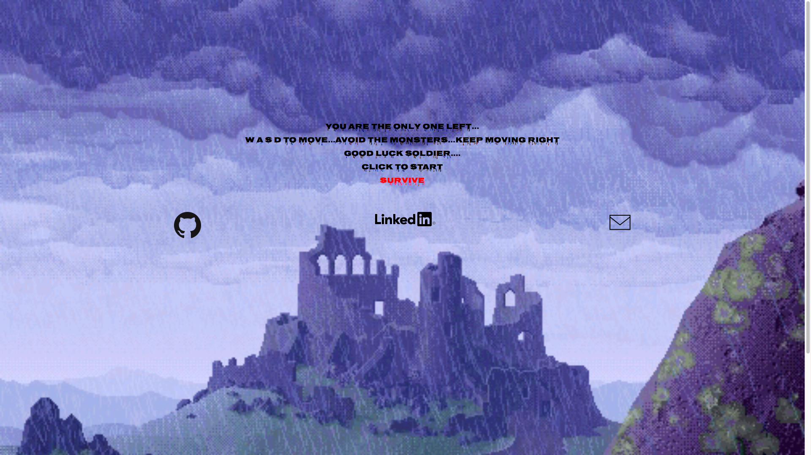
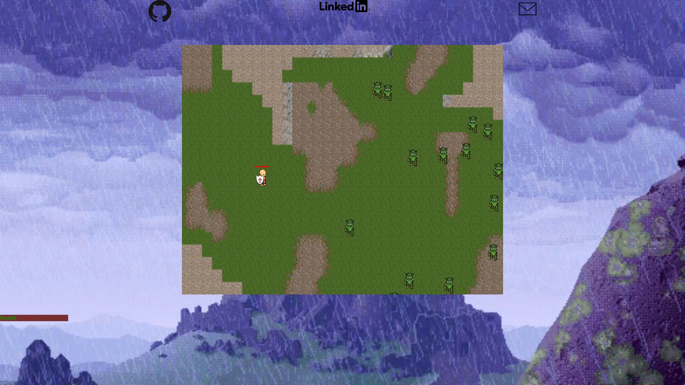

## Escape From Teutoburg

## [Live Site](https://kamanfi.github.io/EscapeFromTeutoburg/index.html)

### Background

EscapeFromTeutoburg is a sprite based game of survival, a lone legionnaire nust survived the hordes of monsters as he tries to make it back to Rome

### Functionality & MVP  

- [ ] Use the keyBoard to move the legionnaire and avoid monsters 
- [ ] Healthbar that decreases if legionnair comes in contact with germanic soldiers
- [ ] Periodically spawns a boss that will be harder to avoid

In addition, this project will include:

- [ ] A production README

### Wireframes

This app will consist of a single screen with the game view in the middle , about modal below that,nav links to the Github, my LinkedIn and Website on the right and a highscore board on the right 

### Architecture and Technologies

This project will be implemented with the following technologies:

- `JavaScript` for game logic,
- `Webpack` to bundle js files.

In addition to the entry file, there will be four scripts involved in this project:

`board.js`: this script will handle the logic for rendering legionnaire / Germanic Soldiers / Boss and their interactive logic

`legionnaire.js`: this script will handle draw the player(legion) and implement movement logic,

`Germanic Soldiers.js` and `Boss.js`: this script will draw the Germanic Soldiers/Boss and implement their logic,

### Implementation Timeline

**Day 1**: Setup all necessary Node modules, including getting webpack up and running.

- Get a green bundle with `Webpack`
- Learn enough about how to use sprites with canvas to render an object to the board.js file
- Be able to draw all 3 characters for my game( import spirits)

**Day 2**: Dedicate this day to background

- Make background for game
- learn how to loop bakground infinitely/ move camera
- learn how to periodically "spawn" enemies on screen 
- Bosses will spawn less frequently than germanic soldiers

**Day 3**: Create interactive logic between 3 characters ( germanic soldiers, legionnaire, boss)
- If the player(legionnaire) touches any monster, he dies 
- Make sure spawn of boss and skeletons soldeirs are random

**Day 4**: Install the controls for the user to move legionnaire.
- Make sure player can move legionnaire
- Learn about firebase and implement highscore logic

### Bonus features

- [ ] Add random "power up" item that allows legionnaire to throw "pilum" to kill skeletons
- [ ] Add random "power up" item that allows legionnaire to throw raise shield and take no dmg from collisions

